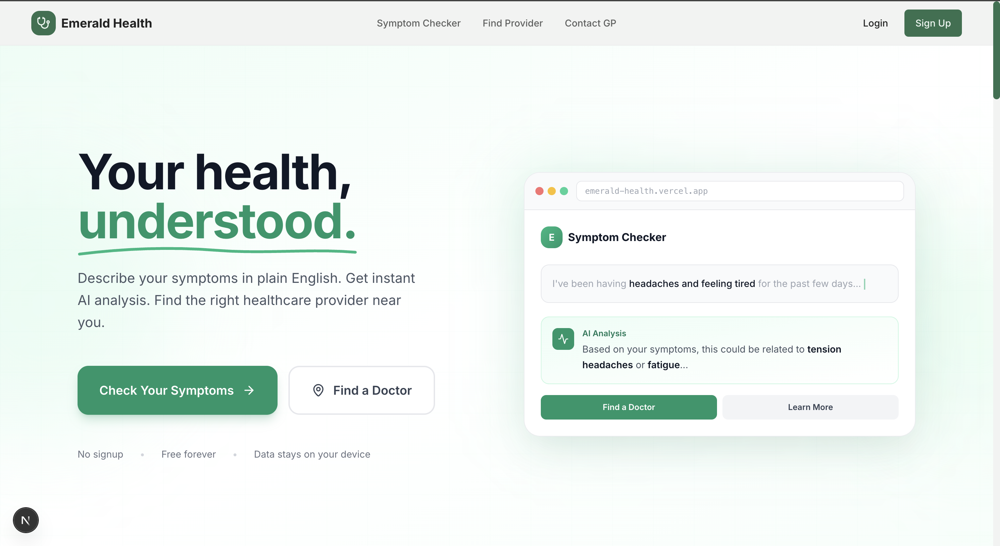
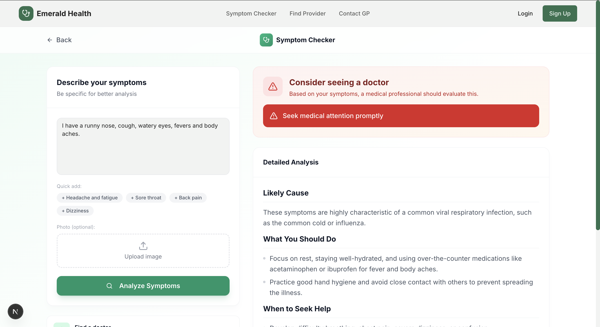
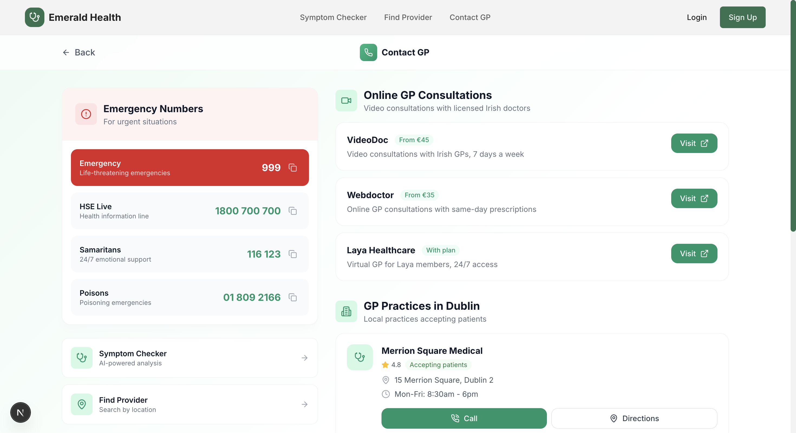

<h1 align="center">🍀 Emerald Health</h1>

<p align="center">
  <strong>AI-Powered Healthcare for Ireland</strong><br/>
  Built at Google Student AI Hackathon · Dublin · June 2025
</p>

<p align="center">
  <a href="#about">About</a> •
  <a href="#features">Features</a> •
  <a href="#tech">Tech</a> •
  <a href="#my-role">My Role</a> •
  <a href="#learnings">Learnings</a> •
  <a href="#team">Team</a>
</p>

<p align="center">
</p>

---

## About

8 hours. Google's Dublin office. 5 students who'd never met before. The theme was "AI for Healthcare."

We ended up building an AI symptom checker because navigating healthcare in Ireland is genuinely confusing - especially if you're new here or just don't know where to start. Describe what's wrong in plain English, upload a photo if it helps, and get a preliminary assessment that tells you whether you should probably see a doctor.

Called it "Emerald" after the Emerald Isle. Green and white throughout because trust + Ireland.

<p align="center">
  
</p>

---

## Features

### 🩺 Symptom Checker

Type what's bothering you. The AI (Gemini 2.5 Flash) reads it, figures out what might be going on, and tells you:
- What it could be
- How serious it might be
- Whether you should see someone

You can also upload photos - useful for rashes, swelling, stuff like that.

<p align="center">
  
</p>

### 📍 Find Provider

Search by city or Eircode. Filter by GPs, hospitals, or specialists. Tap to call, tap for directions.

<p align="center">
  
</p>

### 📞 Contact GP

Emergency numbers you might actually need (999, HSE Live, Samaritans, Poisons Centre). Telehealth options with pricing. GP practices you can call right now.

<p align="center">
  
</p>

---

## Tech Stack 

TypeScript, JavaScript, HTML, CSS, Gemini API, Vercel

<p align="center">
  
</p>


## My Role

I worked on the backend and AI integration:

**APIs**
- Wired up Google's Generative AI SDK
- Built the symptom analysis flow
- Set up error handling so it fails gracefully

**Prompt engineering**
- This was harder than expected. You want the AI to be helpful but not diagnose anyone or say "you're fine" when they're not. Spent hours tweaking the system prompt to find that balance.

**Image analysis**
- Got photo uploads working with Gemini's multimodal input
- Had to handle base64 encoding, file size limits, the works

**Production fixes**
- Hydration errors (classic Next.js)
- React hook violations
- A CVE vulnerability that blocked our Vercel deploy

```typescript
// The core of it
const model = genAI.getGenerativeModel({
  model: "gemini-2.5-flash",
  generationConfig: {
    temperature: 0.7,
    maxOutputTokens: 4096,
  }
});
```

---

## Learnings

**What worked:**
- We divided tasks according to everyone's strenghts
- Building the AI first, UI second. We knew the core worked before making it pretty
- Saying no to features - rejected probably 10+ ideas to ship 3 good ones

**What was hard:**
- The weight of knowing people might use this for real health decisions
- Making a nice powerpoint! (Yes, we underestimated this part a little and didn't allocate a lot of time for this)

---

## Run Locally

```bash
git clone https://github.com/DevEnjoysMath/symptom-assessment-tool.git
cd symptom-assessment-tool
npm install

# .env.local
GOOGLE_GENAI_API_KEY=your_key

npm run dev
```

Open [localhost:3000](http://localhost:3000)

---

## Team

<p align="center">
  
</p>

<p align="center">
  Walked in as strangers and ended up becoming friends :)<br/>
  <sub>A special thanks to our mentor, Aiden Molloy for all his guidance throughout the hackathon. (and Google organizing this event. The office is unreal btw.)</sub>
</p>

---

<p align="center">
  Google Student AI Hackathon 2025
</p>
